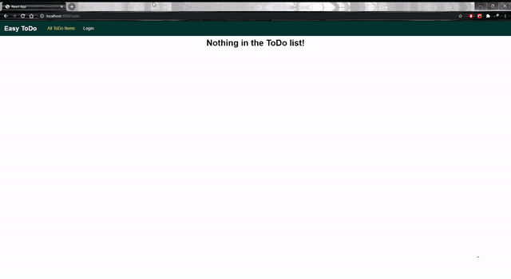

# A ToDo App Backend

## Stack Used:
  - NodeJS
  - Express
  - GraphQL
  - MongoDB
## Features:
  - SignUp as a new User
  - Create a ToDo Item (Only if Logged In)
  - Read/View all ToDo Items by All Users
  - Update a ToDo Item (Only if Logged In)
  - Delete a ToDo Item (Only if Logged In)
  - Search/filter a ToDo Item by Category through the URL (frontend)
